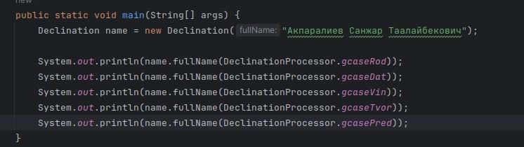
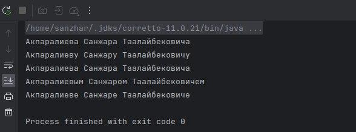

# Библиотека для Склонения Фамилий, Имен и Отчеств на Русском и Кыргызском

## Введение
Эта библиотека предоставляет удобные инструменты для обработки русских и киргизских имен, включая их склонение и форматирование в различных грамматических падежах.
Она может быть использована в ваших Java-проектах для автоматического преобразования имен в нужные формы.

## Использование
1.  Скачайте JAR-файл:

[Ссылка для скачивания JAR-файла](https://github.com/SanzharAkparaliev/Declension-of-full-name-Russion-And-Kyrgyz/blob/master/lib/declination-names-russion-and-kyrgyz-0.0.1-SNAPSHOT.jar)

2. Добавление в проект:
   Скопируйте JAR-файл в папку libs вашего проекта. Если такой папки нет, создайте ее в корне проекта.

- В файле build.gradle вашего проекта добавьте зависимость для JAR-файла в разделе dependencies:
  ```gradle
  implementation files('libs/declination-names-russion-and-kyrgyz-0.0.1-SNAPSHOT.jar')
  ```

### Класс Declination
- Класс Declination предоставляет комбинированный конструктор, который позволяет вам создавать объекты, используя полное имя или явно указывая компоненты, такие как фамилия, имя, отчество, пол, а также обозначения "кызы" и "уулу".
1. С использованием полного имени:
  ```java
    Declination name = new Declination("Акпаралиев Санжар Таалайбекович");
  ```
2. С использованием явного указания компонентов:
  ```java
    Declination explicitName = new Declination("Санжар", "Акпаралиев", "", "m");
  ```
3. С использованием "кызы" и "уулу":
    ```java
    Declination kyzyName = new Declination("Марапат кызы Шарапат");
    Declination uuluName = new Declination("Таалайбек уулу Санжар");
     ```
### Класс DeclinationProcessor
- Класс DeclinationProcessor предоставляет методы для обработки русских и киргизских имен. Вы можете использовать его для склонения фамилий, имен и отчеств в зависимости от грамматических падежей.

> gcaseRod: Родительный падеж
> gcaseDat: Дательный падеж
> gcaseVin: Винительный падеж
> gcaseTvor: Творительный падеж
> gcasePred: Предложный падеж


